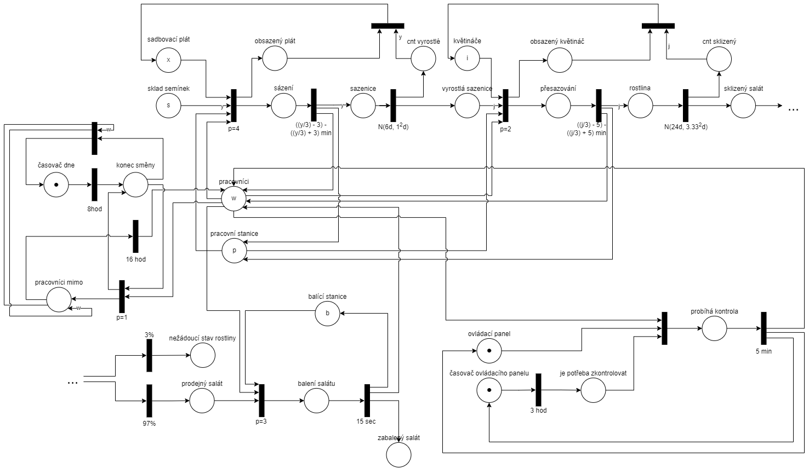

# Růst salátu hlávkového ve vertikální farmě využívající hydroponický systém

Tato studie se zabývá pěstováním lociky seté, běžně známé jako salát hlávkový nebo jen salát, v prostředí vertikální farmy využívající hydroponický systém.

Vertikální zemědělství má mnoho podob, nezrozšířenějšími používanými metodami jsou hydroponické a aeroponické systémy. Model prozkoumává vlastnosti
hydroponického systému, který je z těchto tří nejvíce rozšířený. Tyto systémy představují výrazný pokrok v zemědělství a produkci potravin. Hlavními výhodami 
těchto systémů jsou efektivní využití místa potřebného k produkci potravin a minimalizace potřeby údržby systému při zachování či dokonce zvýšení výnosů.

Studie se zaměřuje na vertikální dynamický systém z pohledu procesů. Jako hlavní zdroje informací byl použit vědecký článek
*Lean Principles in Vertical Farming: A Case Study* a studie *Vertical farming goes dynamic: optimizing resource use efficiency, product quality, and energy costs*. Návrh VFS byl namodelován jako Petriho síť. Následně byly prováděny 
experimenty s tímto modelem za účelem zjištění optimálních parametrů VFS systému.

## Co je to vertikální farma

Vertikální zemědělství je způsob pěstování plodin, který se odehrává ve vnitřních prostorách budov. Rostliny můžou být náskládány na sobě (vrstvy plodin) nebo může
být využito vertikálních pěstební systém (věže)[^10]. Vertikální zemědělství narozdíl on klasického zemědělství výrazně snižuje náklady a využívá méně zdrojů
pro růst plodin. Zároveň je produkováno méně emisí dusičnanů a fosforečnanů.

Tento způsob pěstování plodin zároveň nabízí téměř úplnou kontrolu nad ovlivňujícími faktory, které působí na rostliny. Díky uzavřenému systému
můžeme ovládat faktory jako jsou tok vody a obsah živin ve vodě, vlhkost vzduchu, teplota vzduchu, intenzita umělého osvětlení a obsah CO2 ve vzduchu.

Nejčastějšími plodinami, které se běžně ve vertikálních farmách pěstují jsou plodiny s vysokým *harvest indexem*[^10]. Tento index vyjadřuje jak velkou část plodiny
můžeme prodat. Mezi takové plodiny patří: basalka pravá, čínské zelí, špenát setý, eruca vesicaria (rukola) nebo locika setá, lépe známá jako salát hlávkový[^30]. 
Tato studie je zaměřena právě na farmu produkující salát pomocí hydroponického systému využívající *nutrient film technique (NFT)*. 
Techniky hydroponického systému a NFT jsou podrobněji popsány níže.

### Hydroponický systém

Hydroponický systém je metoda pěstování rostlin bez použití půdy, při které jsou kořeny rostlin ponořeny přímo do 
živného roztoku. Tato technika umožňuje optimalizovat dodávku živin a vody přímo ke kořenům, což zajišťuje efektivní růst a minimální plýtvání zdroji[^1].

Hydroponické systémy využívají různé techniky, jako je kapkové zavlažování, technika hluboké vody (deep water culture), nebo tenký film 
živného roztoku (nutrient film technique, NFT). V případě vertikálních farem je NFT oblíbenou volbou díky možnosti zajištění kontinuálního 
proudění živného roztoku v uzavřených kanálech.

### Nutrient film technique (NFT)

NFT je metoda hydroponického pěstování, která zahrnuje kontinuální tok tenkého filmu živného roztoku přes kořeny rostlin. 
Tím je dosaženo efektivního zásobování živinami a kyslíkem při minimální spotřebě vody[^1]. Tento systém je vhodný zejména pro plodiny s 
mělkými kořeny, jako je salát hlávkový.

## Fakta o systému

Systém byl modelován podle předlohy ve vědeckém článku *Lean Principles in Vertical Farming: A Case Study*, který zkoumal farmu 
ve městě Liverpool, Spojené království Velké Británie a Serverního Irska.

S parametry bylo experimentováno a byly hledány úzká místa sytému, příležitosti na zlepšení a zjišťován zisk s ohledem na výnosy a náklady.

### Procesy na farmě

Provoz vertikální farmy zahrnuje celou řadu činností, které zajišťují efektivní růst rostlin, jejich sklizeň, balení a doručení zákazníkům[^11].

- na farmě je připraveno *x* sadbovacích plátů, které každé pojmou *y* semínek
- dále je na farmě *i* květináčů z nichž každý pojme *j* sazenic

- farma pracuje neustále po dobu dnů *t*

- na začátku se do farmy nakoupí *s* semínek, ze kterých klíčí rostliny
    - semínka se sadí do plátů, pokud není plát osazený celý, nepostupuje do další fáze (růst)[^12]
- sazenice vyklíčí za 4-8 dní[^8] normální rozložení se střední hodnotou 6 a směrodatnou odchylkou 1.33
    - pokud na plátu zbývá pouze pár nevyklíčených semínek, jsou přesunuty na pláty kde je místo
    - pro ušetření místa pracovníci přeskládávají sazenice tak, aby mohli co nejdříve odebrat prázdný plát (děje se implicitně při přesazování a sázení)
- po vyklíčení je přesunuta do vertikální věže - stejný princip květináčů jako plátů

- pokud má pracovník volno, zkontroluje každé dvě hodiny ovládací panel a ukazatele na něm, v případě potřeby seřídí nastavení vertikální farmy (průtok vody, vlhkost, teplotu atd...)
- pracovníci pracují každý den od 7:00 do 15:00
    - vždy než odejdou domů, dokončí svou práci

- rostlina zraje 25-35 dní[^7] normální rozložení se střední hodnotou 30 a směrodatnou odchylkou 3.33
- rostlina za dobu svého růstu spotřebuje 2 litry vody a 5 kWh elektřiny, pokud tyto zdroje nemá rostlina nedorůstá požadované velikosti nebo uvadá
- zralý salát se prodá průměrně za 30 Kč za hlávku
- cena vody se pohybuje okolo 12 haléřů za litr [^28]
- cena kWh se pohybuje okolo 3 korun [^29]

### Zdroje na farmě

- ve farmě se vyskytují 
    - 4 pracovníci (parametr)
    - 2 pracovní plochy (parametr)
        - úkoly prováděny na této ploše
            - sazení semínek do sadbovacích plátů
            - přesazování semínek do květináčů
            - příprava salátu k následnému balení
            - kontrola rostoucích sazenic
        - na každé ploše může pracovat pouze jeden pracovník
    - 1 balicí plocha (parametr)
        - zde se očištěný salát připravuje do sáčků

## Petriho síť

<!-- Resources -->
[^1]: *Kaiser, E. et al. (2024) Vertical farming goes dynamic: Optimizing resource use efficiency, product quality, and energy costs, Frontiers.* Available at: https://www.frontiersin.org/journals/science/articles/10.3389/fsci.2024.1411259/full (Accessed: 25 November 2024).
[^2]: *Stephen Albert. Lettuce growing problems and solutions.* https://harvesttotable.com/lettuce_growing_problems_troub/
[^3]: *McDonald, K. (2023, November 3). A focus on lettuce | Vertical Farming - Upstart University. Upstart University.* https://university.upstartfarmers.com/blog/focus-lettuce-vertical-farming
[^4]: *Roberts, J. M., Bruce, T. J. A., Monaghan, J. M., Pope, T. W., Leather, S. R., & Beacham, A. M. (2020). Vertical farming systems bring new considerations for pest and disease management.* Annals of Applied Biology, 176(3), 226–232. https://doi.org/10.1111/aab.12587
[^5]: *Kaufmann, C. (2023). Reducing Tipburn in Lettuce Grown in an Indoor Vertical Farm: Comparing the Impact of Vertically Distributed Airflow vs. Horizontally Distributed Airflow in the Growth of Lactuca sativa.* Repository of The University of Arizona. Retrieved 25 November. 2024, from https://repository.arizona.edu/handle/10150/668394.
[^6]: *Deng, Z. & Song, S.. (2012). Sodium nitroprusside, ferricyanide, nitrite and nitrate decrease the thermo-dormancy of lettuce seed germination in a nitric oxide-dependent manner in light.* South African Journal of Botany - S AFR J BOT. 78. 10.1016/j.sajb.2011.06.009. 
[^7]: *Iyakaremye, Jean-Paul. “Hydroponic Lettuce Production.”* 2020, West Lafayette, Public Research University in West Lafayette, Indiana, United States. jiyakare@purdue.edu https://www.purdue.edu/hla/sites/cea/wp-content/uploads/sites/15/2024/05/Hydroponic-lettuce-production.pdf
[^8]: *M, J. (2022, December 25). What is the Best Temperature for Growing Lettuce? (3 Tips).* GreenUpSide. https://greenupside.com/what-is-the-best-temperature-for-growing-lettuce-3-tips/ 
[^9]: *Tibbitts, Theodore & Bottenberg, G.B.. (1976). Growth of lettuce (Lactuca sativa) under controlled humidity levels.* Journal American Society of Horticultural Science. 101. 70-73. 
[^10]: Kaiser, E., Folta, K., Vialet-Chabrand, S., & F.M. Marcelis, L. (n.d.). *Vertical farming goes dynamic optimizing resource use.* In Frontiers Forum. Frontiers Forum.
[^11]: https://www.sciencedirect.com/science/article/pii/S2212827120305758
[^12]: https://www.youtube.com/watch?v=o1QXCnC-2h4

[^28]: *skrblík — šetří čas i peníze.* Petr Novák 2024. (n.d.). Skrblík. https://www.skrblik.cz/energie/voda/cena-vody/
[^29]: *Cena 1 kWh elektřiny (aktuální)* 2024. (n.d.). https://www.energie123.cz/elektrina/ceny-elektricke-energie/cena-1-kwh/
[^30]: *Wikipedie: Otevřená encyklopedie: Locika setá* [online]. c2024 [citováno 26. 11. 2024]. Dostupný z WWW: <https://cs.wikipedia.org/w/index.php?title=Locika_set%C3%A1&oldid=24186621>  
